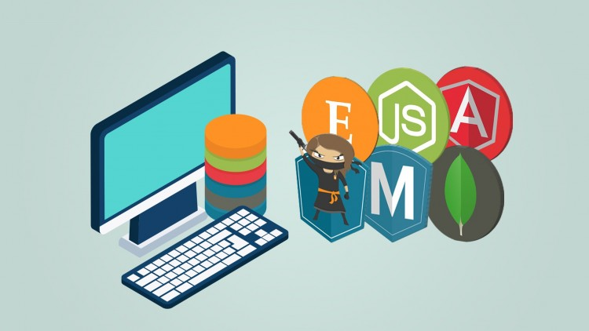

# Intro to the MEAN Stack

## Learning Objectives

- List three similarities between an MEAN app and a Rails app
- Server Side Rendering vs. Client Side Rendering
- Client Side Rendering via AngularJS, etc
- Motivation to use MEAN
- Comparison of Rails and MEAN Stack
- What is MongoDB
- What is NodeJS
- What is AngularJS

## Framing

The term ME(A)N stack refers to a collection of JavaScript based technologies used to develop web applications. MEAN is an acronym for MongoDB, ExpressJS, AngularJS and Node.js. From client to server to database, MEAN is full stack JavaScrip

### Information Dive (5 / 10)
What are the teachnologies in the ME(A)N stack?

### T&T (5 / 15)
Now, turn & talk to your neighbor and discuss:

1. At a high level, what are the different technologies of the ME(A)N stack used for?
2. Where do these tehcnologies fall in the MVC pattern?

## Framework

A software framework, in computer programming, is an abstraction in which common code providing generic functionality can be selectively overridden or specialized by user code providing specific functionality. Frameworks are a special case of software libraries in that they are reusable abstractions of code wrapped in a well-defined Application programming interface (API), yet they contain some key distinguishing features that separate them from normal libraries.

* Frameworks allow us to be `full-stack` developers.
* We can:
  - define the database tables
  - develop server-side code:
     * database integration
     * business logic
     * consume external APIs
     * provide a RESTful API
     * security
     * notifications / server push
  - develop client-side code:
     * HTML       - structure
     * CSS        - styling
     * JavaScript - client side events, updates, validations, integration with APIs

* Trends
  - Moving more of the application logic away from the server and into the front end.
  - What usually gets moved from server to client:
      * View Rendering
      * Validations
      * Routing (Single-Page Apps / SPAs)
  - Why?
      * Faster / more responsive user experience
      * Develop multiple clients with a single shared Server as a RESTful API
  - Some of the more popular JavaScript frameworks doing this are:
      * AngularJS
      * Backbone
      * Ember

* This is not really new (though it is new to Web App Development)
  - dump terminals and `time-sharing` of mainframes
  - desktop apps
  - SaaS and cloud computing
  - Cloud data with Local computation

### Information Dive (5 / 10)
What are advantages of using a javascript framework vs plain jane javascript?

### T&T (5 / 15)
Now, turn & talk to your neighbor and discuss:

1. 3 pros of using a javascript framework 
2. Any cons of using a framework

### Server Side Rendering vs. Client Side Rendering

*Rendering is the action of giving, yielding, or surrendering something

Q: What does it mean to render a view

A: Generating a view from a template and a set of data

    HTML Template + JSON data === (render) ===> HTML page

* Server-side rendering: HTML page is generated and `rendered` on the server
* Client-side rendering: HTML page is served from server as a `template` and fully rendered in the browser
  - sets the stage for dynamic updates to the DOM via JavaScript
  - AJAX
  - GMail, Google Maps

### Rails

* Leans heavily on server-side rendering
* Some client-side rendering can be "sprinkled in".
* Most user actions (mouse clicks) hit the server.

### Client Side Rendering via AngularJS, etc.

* Provides rich support for client-side rendering
* Sees server as a simple RESTful API with security and persistence:
  - HTTP GET, PUT, POST, DELETE
  - JSON data

We *can* use AngularJS with Rails, but it seems a bit overkill:

* both provide MVC
* both do rendering (templates)
* both provide routing

## Motivation to use MEAN

* JavaScript throughout all layers
  - Browser
  - RESTful API (JSON)
  - Server (NodeJS)
  - Database (MongoDB uses BSON = Binary JSON)
* Better Support for Client-side Rendering
  - The Rails Asset Pipeline gets in the way ([More on The Asset Pipline](https://launchschool.com/blog/rails-asset-pipeline-best-practices))
  - Rails MVC seems like overkill: default is that every RESTful endpoint has a View
* Improved performance and scalability due to *fast* asynchronous I/O
* MongoDB is easier to use than RDBMS
* JSON throughout the integration layers
* AngularJS is a rich client-side MVC SPA Framework that makes DOM manipulation easy

## Comparison of Rails and MEAN Stack

[MEAN VS Rails ](http://vschart.com/compare/express-web-framework/vs/ruby-on-rails)

|        Feature          |          Rails                |              MEAN              |
|:-----------------------:|:-----------------------------:|:------------------------------:|
| Database                | usually RDBMS (SQL)           | MongoDB (NoSQL)                |
| Server Language         | Ruby                          | JavaScript via NodeJS          |
| Server Framework        | Rails                         | Express, Hapi, others          |
| ORM / DB Integration    | Active Record                 | Mongoose                       |
| Package Manager         | Bundler                       | npm                            |
| Client/Server Interface | HTML or RESTful API with JSON | RESTful API with JSON          |
| Client Language         | JavaScript                    | JavaScript                     |
| Client Presentation     | HTML / CSS                    | HTML / CSS                     |
| Rendering               | Server                        | Client                         |
| Client Updates          | Favors Server Rendering       | Favors Client Rendering & Partial Updates (AJAX)  |
| Best Tutorial | Hartl | The MEAN Machine |

## Introducing the MEAN Stack

### MongoDB

* A NoSQL database
* A document database
* Stores Binary JSON (BSON)
* Easy to get up and running

### NodeJS

* A JavaScript runtime environment on the server
* Uses Google's V8 JavaScript engine
* Contains a built-in HTTP server library

### ExpressJS

* Server-side MVC for NodeJS
* Much more lightweight than Rails

### AngularJS

* A full-featured client-side MVC Framework
* Works well for SPA applications
* Makes DOM manipulation via AJAX calls easy
* Offers 2-way data-binding to simplify the HTML/JS interaction

## Closing

